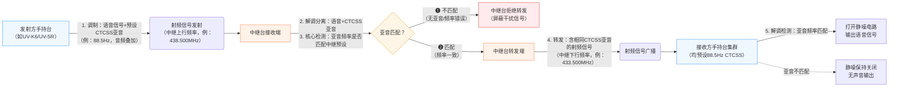

在业余无线电通信中，“亚音”是解决频率干扰、实现信号精准接收的核心技术。无论是中继台接入、小组专属通信，还是避免无关信号误触发静噪，亚音都扮演着“信号钥匙”的角色。本文将详细拆解**模拟亚音（CTCSS）** 与**数字亚音（DCS）** 的技术原理、调制解调流程、核心差异，并结合实际应用场景给出选型建议，帮助无线电爱好者快速掌握亚音技术的实操要点。

> ⚠️ 重要提醒：
> 1. 亚音仅作用于接收端静噪控制，不会改变通信信号的频率和内容；设置亚音时需确保通信双方（或与中继台）的亚音类型、参数完全一致，否则会出现「能发射但无法接收」的情况。
> 2. 亚音技术仅为静噪筛选手段，**非加密技术**，通信信号仍为明文传输，切勿用于涉密信息交流。
> 3. 发射亚音时，接收方设置到「非亚音接收状态」可直接接收；设置到「亚音接收状态」时，必须**亚音类型一致+参数一致**才能接收。

## 一、模拟亚音（CTCSS）：经典可靠的“音频钥匙”
### 1.1 什么是模拟亚音（CTCSS）
CTCSS 全称 Continuous Tone-Coded Squelch System（连续音调控制静噪系统），是最早普及的亚音技术。它通过在语音信号中叠加**30Hz-250Hz的低频连续正弦波**（人耳几乎听不到），接收端检测到对应频率的亚音后，才打开静噪电路让语音通过，否则保持静噪关闭，屏蔽无关干扰。

> 核心特点：模拟信号、单一低频音调、技术成熟、成本低，是业余无线电入门最常用的亚音类型。

### 1.2 核心应用场景
- **中继台接入控制**：多数业余中继台要求发射信号携带指定CTCSS频率（如中继常用88.5Hz），避免无关信号占用中继资源；
CTCSS的核心工作流程（尤其是中继台应用场景）可通过以下流程图直观理解，从发射方调制到接收方静噪控制的全链路均做了清晰拆解：

- **小组通信隔离**：同一频率下，不同小组使用不同CTCSS频率，实现“同频异音”的互不干扰通信（如野外活动多小组同时通联）；
- **简易抗干扰**：屏蔽无亚音的杂波信号（如电磁干扰、其他电台的无意发射），减少静噪误触发。

### 1.3 工作原理
1. **发射端**：麦克风采集的语音信号与CTCSS低频音调（30Hz-250Hz）通过混合器叠加，共同调制射频信号后发射；
2. **接收端**：射频信号解调后，分离出语音信号和CTCSS音调，通过音调检测器验证频率是否匹配；
3. **静噪控制**：若音调频率与预设值一致，控制电路打开静噪，语音信号输出；若不匹配或无亚音，静噪保持关闭，无声音输出。

### 1.4 调制方式
CTCSS采用**幅度调制（AM）叠加**方式，亚音信号与语音信号在音频层面混合，不改变射频信号的调制模式（如FM对讲机仍保持调频）。

- 亚音幅度通常为语音信号幅度的10%-20%，避免亚音过强影响语音清晰度，或过弱导致接收端无法检测；
- 常用CTCSS频率（国际标准）：67.0Hz、71.9Hz、88.5Hz、100.0Hz、114.8Hz、127.3Hz等，共38个标准频率。

### 1.5 解调方式
接收端解调核心是**窄带滤波+频率检测**：
1. 解调后的音频信号通过窄带滤波器（中心频率对应预设CTCSS频率），分离出亚音信号；
2. 频率检测器（如锁相环PLL、比较器）判断滤波后的信号频率是否与预设值一致；
3. 输出控制信号（高/低电平），控制静噪电路的开关。

### 1.6 常用调制解调器（硬件/芯片）
- 入门级：分立元件搭建（滤波器+比较器），适合实验或简单设备；
- 集成芯片：摩托罗拉MC145160、TI TCM3105，内置CTCSS编码/解码功能，广泛用于民用对讲机；
- 软件解调：SDR（软件无线电）设备通过软件算法提取亚音频率，灵活支持多频率检测（如GNU Radio）。

## 二、数字亚音（DCS）：高效抗干扰的“数字钥匙”
### 2.1 什么是数字亚音（DCS）
DCS 全称 Digital-Coded Squelch（数字编码静噪系统），是替代CTCSS的数字亚音技术。它用**二进制数字编码**（而非模拟音调）作为“钥匙”，通过特定的数字序列调制射频信号，接收端解码验证通过后才打开静噪。

> 核心特点：数字编码、抗干扰性强、编码数量多、支持反向burst（唤醒信号），适合专业通信或复杂电磁环境。

### 2.2 核心应用场景
- **专业中继台/集群通信**：需要严格频率管理的场景（如公安、消防、行业用户），DCS的高抗干扰性和多编码优势更突出；
- **多小组高密度通信**：同一频率下支持更多小组同时通信（DCS编码数量远多于CTCSS），如大型活动、赛事调度；
- **强干扰环境通信**：工业区域、城市密集区等电磁干扰严重的场景，DCS抗杂波能力优于CTCSS；
- **设备唤醒**：支持“反向burst”功能（发射端仅发送DCS编码，不发送语音），用于唤醒接收端静噪，节省功耗。

### 2.3 工作原理
1. **发射端**：将预设的DCS数字编码（如023、131、503）通过FSK（频移键控）调制为低频数字信号，与语音信号叠加后，再调制射频信号发射；
2. **接收端**：射频信号解调后，分离出语音信号和DCS数字信号，通过解码器还原数字编码；
3. **静噪控制**：若还原的编码与预设值一致，打开静噪输出语音；否则保持静噪关闭。

> 关键差异：DCS编码是**离散的数字序列**（而非连续音调），传输过程中不易受噪声干扰，且支持错误校验。

### 2.4 调制方式
DCS采用**FSK（频移键控）调制**，核心参数：
- 编码格式：3位八进制数（000-777），共512个标准编码（实际可用496个，部分编码预留）；
- 调制速率：134.3bps（比特率），每个编码由23 位 Golay (23,12) 纠错码组成（含 12 位核心数据位 + 11 位校验位），具备纠正 3 位传输错误的能力；
- 载波频率：1200Hz（逻辑0）和1800Hz（逻辑1），属于音频范围，与语音信号叠加后不冲突；
- 调制深度：通常为语音信号的10%-15%，平衡语音清晰度和编码检测灵敏度。

### 2.5 解调方式
接收端解调核心是**FSK解码+编码校验**：
1. 解调后的音频信号通过FSK解码器，将1200Hz/1800Hz的频移信号还原为二进制数字序列；
2. 解码器对数字序列进行同步校验（如前导同步位、奇偶校验），排除噪声导致的错误编码；
3. 对比还原的编码与预设DCS编码，一致则输出静噪控制信号。

### 2.6 常用调制解调器（硬件/芯片）
- 集成芯片：摩托罗拉MC145176、Silicon Labs Si4463，内置DCS编码/解码模块，支持标准DCS编码集；
- SDR软件解调：通过软件算法实现FSK解码和编码校验（如GNU Radio、SDR#插件），支持自定义编码；
- 对讲机模块：海能达、摩托罗拉专业对讲机内置DCS功能，可通过菜单直接设置编码（如DCS 023N、DCS 131R，N=正向，R=反向）。

## 三、CTCSS与DCS核心差异对比
| 对比维度         | 模拟亚音（CTCSS）                | 数字亚音（DCS）                  |
|------------------|----------------------------------|----------------------------------|
| 编码类型         | 模拟低频音调（30Hz-250Hz）       | 二进制数字编码（3位八进制）      |
| 编码数量         | 38个标准频率                     | 496个可用编码（000-777）         |
| 抗干扰性         | 较弱（易受同频噪声、谐波干扰）   | 较强（数字编码+校验，抗杂波能力强）|
| 语音影响         | 可能因亚音叠加导致语音轻微失真   | 数字编码与语音分离，无失真影响    |
| 功耗             | 较低（模拟电路简单）             | 较高（数字解码需额外计算资源）    |
| 启动速度         | 快（连续音调，接收端即时检测）   | 稍慢（需接收完整编码序列，约100ms）|
| 兼容性           | 所有民用对讲机均支持             | 部分入门级对讲机不支持           |
| 成本             | 低（分立元件或廉价芯片）         | 较高（需专用解码芯片或软件资源） |
| 特殊功能         | 无                               | 支持反向burst（唤醒）、编码锁定  |

> 主观评价：CTCSS胜在简单、通用、低成本，适合业余爱好者入门和普通场景；DCS胜在抗干扰、多编码、功能丰富，适合专业用户或复杂环境，但门槛略高。

## 四、选型建议与实操注意事项
### 4.1 选型建议
- ✅ 优先选CTCSS的场景：
  - 入门级对讲机（如宝锋UV-5R，UV-K6）；
  > UV-K6设置模拟亚音实拍 
  - 简单中继台接入（多数业余中继台同时支持CTCSS和DCS，CTCSS设置更便捷）；
  - 低功耗设备（如手持对讲机、便携电台，CTCSS功耗更低）。
- ✅ 优先选DCS的场景：
  - 强干扰环境（城市密集区、工业区域）；
  - 多小组同时通信（需更多编码区分）；
  - 专业通信需求（如赛事调度、行业应用）；
  - SDR设备或软件无线电项目（DCS软件解调更灵活）。

### 4.2 实操注意事项
1. **参数一致性**：通信双方（或与中继台）需同时匹配“亚音类型+参数”（CTCSS频率/DCS编码），缺一不可；
2. **DCS编码格式**：注意编码后的“N/R”标识（N=正向编码，R=反向编码），如中继台要求DCS 131N，发射端需设置一致，否则无法接入；
3. **亚音强度调节**：部分专业对讲机支持亚音幅度/深度调节，过强会影响语音质量，过弱会导致接收端无法检测，建议默认设置（10%-20%）；
4. **干扰排查**：若出现“能接收但无法发射”或“静噪频繁误触发”，优先检查亚音类型是否匹配，其次排查电磁干扰（如远离电源、金属物体）；
5. **中继台规则**：接入业余中继台前，需查询该中继台的亚音要求（通常发布在无线电协会官网、中继台管理员公告），避免违规占用频率。

## 五、总结
CTCSS和DCS作为两种核心亚音技术，分别对应“简单实用”和“高效抗干扰”的需求。对于业余无线电爱好者而言，CTCSS是入门必备技能，操作简单且兼容性广；DCS则是进阶方向，适合追求更稳定、更灵活通信的场景。

本质上，亚音技术的核心是“信号筛选”，无论模拟还是数字，都是通过特定“钥匙”让接收端只响应目标信号。在实际使用中，需根据设备支持情况、通信场景和电磁环境选择合适的亚音类型，才能实现清晰、无干扰的无线电通信。

> ⚠️ 申明：本文内容由作者结合实际实操经验撰写，部分技术细节（如解调原理）借助 AIGC 工具辅助整理，所有内容均经过作者亲自验证，确保准确可信。
